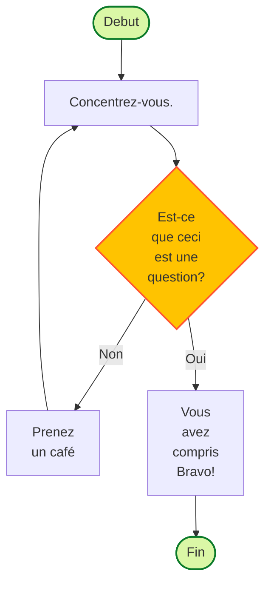

# Wikiki Sample
Un repository pour tester le wikiki !!!

### Basic Flowchart Example

```mermaid
flowchart TD

    start([Debut]) --> action[Concentrez-vous.]
    action --> question{Est-ce\nque ceci\nest une\nquestion?} 
    question -- Non --> reponse2[Prenez\nun café]
    question -- Oui --> reponse1[Vous\navez\ncompris\nBravo!]
    reponse2 --> action
    reponse1 --> out([Fin])


classDef StartAndEnd fill:#DAF7A6,stroke:#0B7A2A,stroke-width:2px;
classDef Question fill:#FFC300,stroke:#FF5733,stroke-width:2px;
classDef Loop fill:#ffecb3,stroke:#FFC300,stroke-width:2px;
classDef Exception fill:#FF5733,stroke:#C70039,stroke-width:2px;


class start,out StartAndEnd;
class question Question;

```
